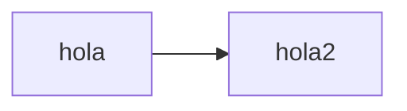

# UASDdb_aspx2json

UASD database aspx to json is a python script that allows you to get data from the UASD ASPX server and translate it into JSON to be use as an API.

## Requirements

*Requiered* packages:

* Requests
* Json
* Pandas
* OS

